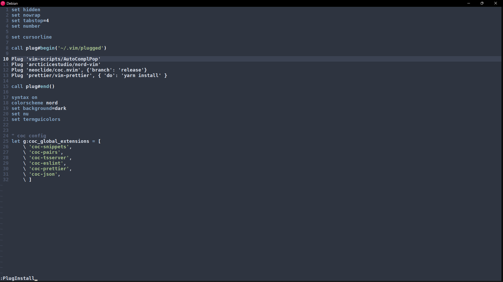
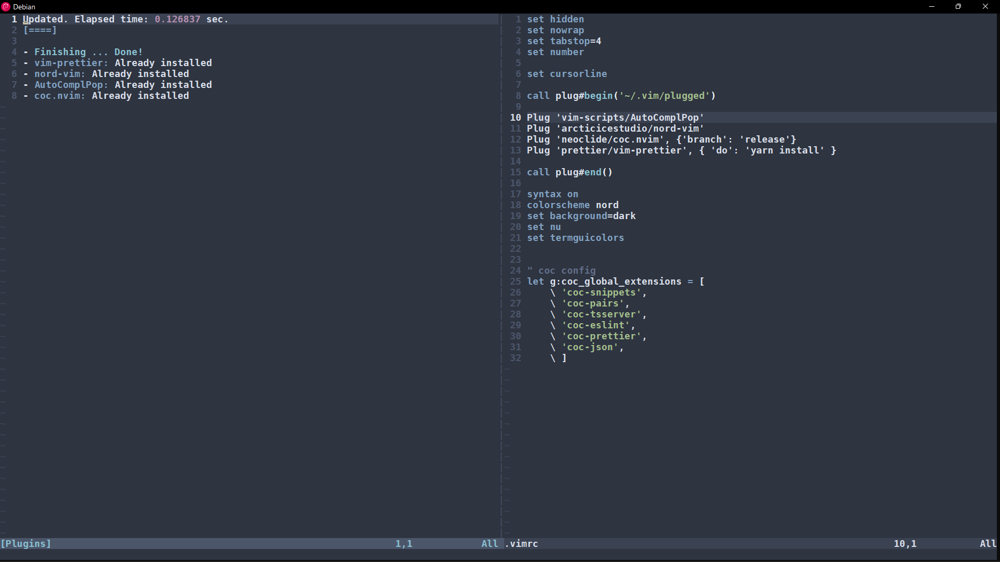

# Make your vim look like me!!

## Steps
1. Install [Vim](https://github.com/vim/vim)
    ```bash
    sudo apt install vim
    ```

2.  Install [neovim](https://github.com/neovim/neovim)
    - Go to [here](https://github.com/neovim/neovim/releases/latest), and download the ```nvim-linux64.deb``` file (assuming linux).

    - Execute it by running
        ```bash
        sudo apt install ./nvim-linux64.deb
        ```

    - Clean dir
        ```bash
        sudo rm -r neovim
        ```

3.  Install [Plug](https://github.com/junegunn/vim-plug)
    ```bash
    curl -fLo ~/.vim/autoload/plug.vim --create-dirs https://raw githubusercontent.com/junegunn/vim-plug/master/plug.vim
    ```

4. Edit .vimrc file
    - Create this file in ```/home/username``` if not present
        ```bash
        touch .vimrc
        ```
    
    - Plugins I'm using for ```vim```
        - [AutoComplPop](https://github.com/vim-scripts/AutoComplPop)
        - [Nord Theme](https://github.com/arcticicestudio/nord-vim)
        - [neoclide](https://github.com/neoclide/coc.nvim)
        - [Prettier](https://github.com/prettier/vim-prettier)

    - My Final ```.vimrc``` File
        ```bash
        set hidden
        set nowrap
        set tabstop=4
        set number

        set cursorline

        call plug#begin('~/.vim/plugged')

        Plug 'vim-scripts/AutoComplPop'
        Plug 'arcticicestudio/nord-vim'
        Plug 'neoclide/coc.nvim', {'branch': 'release'}
        Plug 'prettier/vim-prettier', { 'do': 'yarn install' }

        call plug#end()

        syntax on
        colorscheme nord
        set background=dark
        set nu
        set termguicolors

        " coc config
        let g:coc_global_extensions = [
            \ 'coc-snippets',
            \ 'coc-pairs',
            \ 'coc-tsserver',
            \ 'coc-eslint',
            \ 'coc-prettier',
            \ 'coc-json',
            \ ]
        ```

    - Install added plugins
        1. Open this ```.vimrc``` in vim
        2. Get into ```command``` mode, (by pressing ```Esc```).
        3. Type ```:PlugInstall```.
            

        4. Press ```Enter```.
            

        5. After installation quit vim.

    - Done 🥳🥳